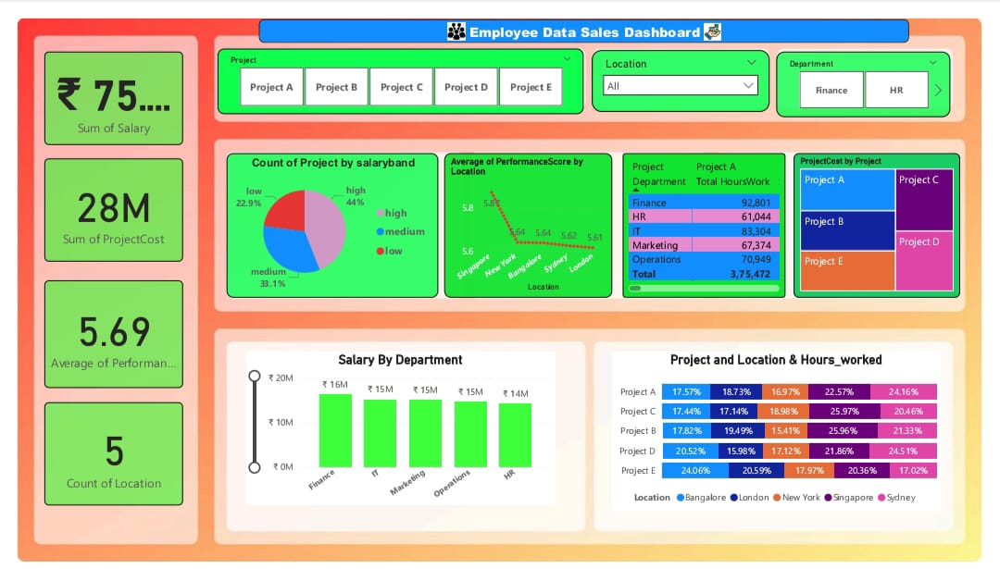

# Employee_Data_Sales_Dashboard
Power BI dashboard analysing employee performance and sales data.
# 📊 Employee Data Sales Dashboard (Power BI)

## 🧾 Overview
This Power BI dashboard provides a detailed analysis of *employee performance and sales metrics*.  
It helps management track productivity, sales growth, and target achievements across departments.

---

## 🎯 Objectives
- Analyze total sales generated by each employee  
- Compare performance across departments and regions  
- Identify top and low-performing employees  
- Track monthly and quarterly sales trends  

---

## 🛠 Tools & Technologies
- *Power BI* – Dashboard creation  
- *Excel / CSV* – Data source  
- *DAX Measures* – Custom calculations  
- *Data Cleaning* – Performed using Power Query  

---

## 📈 Key Insights
- Top 5 employees contributed to 60% of total sales  
- Sales performance increased steadily from Q1 to Q3  
- Regional comparison shows highest growth in the South zone  
- KPI cards show each employee’s sales target vs achievement  

---

## 🖼 Dashboard Preview

---

## 📂 Project Files
| File | Description |
|------|--------------|
| Employee_Data_Sales_Dashboard.pbix | Power BI dashboard file |
| dashboard_preview.png | Dashboard screenshot |

---

## 👤 Author
*Ashokkumar*  
📧 ashokrohit72@gmail.com  
💼 Data Analytics Learner | Power BI Enthusiast  
📍 India  

---

⭐ If you like this project, please give it a star on GitHub!
